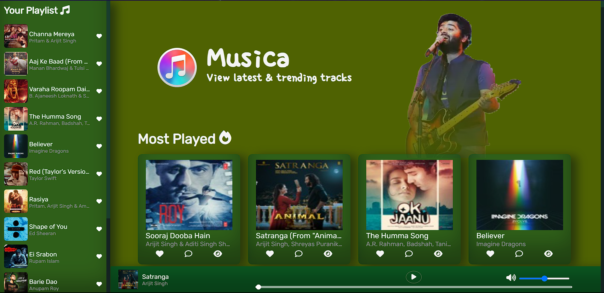

<h1 align="center">Musica - Music App</h1>
<h3 align="center"> A small scale one stop website to stream new songs, write reviews about the songs and practice the songs by keeping personalized music notes</h3>

# Features

- Search Songs.
  
- Make a personalized playlist.
- Listen to new Songs.
- Write reviews about a song.
- Store personalized music notes.
- View old notes of a song.
- Likes Songs.

# Concepts Learned

- Developing interactive UI design using HTML5, CSS3 and Vanilla JavaScript.
- Handling "iTunes Search" API and calling different endpoints of the API.
- Handling Local Storage operations to store User playlist, reviews, likes and notes.
- Building a functional music player from scratch.
- Version Control using GitHub.
- Deploying the website using Netlify.

# Tech Stack

     

<h4 align="left">Check it out here! &#128526;</h4>
[Musica-Music App] (https://musica-music-app-reviews-practice.netlify.app/)
